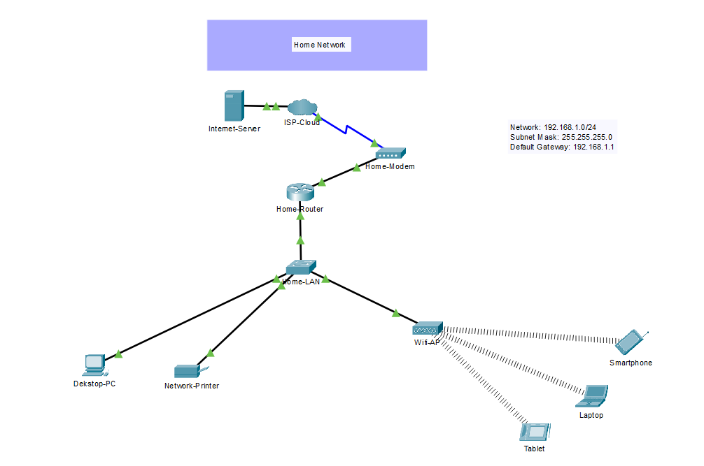

[← Back to portfolio](../README.md)

# Home Network (Cisco Packet Tracer)

## Overview
A simulated home network built in Cisco Packet Tracer. It models how a typical household
connects to the internet through an ISP, modem, and router, then distributes connectivity to
wired and wireless devices over a single LAN.

## Network Topology

## Network Design
| Item | Value |
|---|---|
| Network | 192.168.1.0/24 |
| Subnet Mask | 255.255.255.0 |
| Default Gateway | 192.168.1.1 |
| Topology Type | Star (LAN) |

## Devices
| Device | Role | Connection |
|---|---|---|
| Internet-Server | Simulated internet resource | ISP-Cloud |
| ISP-Cloud | Simulated Internet Service Provider | Home-Modem |
| Home-Modem | Connects the home to the ISP | Home-Router |
| Home-Router | Default gateway for the LAN | Home-LAN switch |
| Home-LAN (Switch) | Central wired connectivity | Router, PC, Printer, Wi-Fi AP |
| Wifi-AP | Provides wireless access | Smartphone, Laptop, Tablet |
| Desktop-PC | Wired client | Switch |
| Network-Printer | Shared network printer | Switch |
| Smartphone, Laptop, Tablet | Wireless clients | Wifi-AP |

## Connectivity Flow
Client device → Wi-Fi AP / Switch → Home-Router → Home-Modem → ISP-Cloud → Internet-Server

## What I Configured
- [ ] IP addressing on all devices 
- [ ] Router interface IPs and default gateway (192.168.1.1)
- [ ] DHCP pool: [range, 192.168.1.100 - 192.168.1.200]
- [ ] Wireless SSID and security (WPA2) on the Wifi-AP
- [ ] Printer IP address: [192.168.1.10]

## Testing & Verification
- Ping from Desktop-PC to the gateway (192.168.1.1)
- Ping between wired and wireless devices
- Ping/browse to the Internet-Server from the PC
- Confirm wireless devices connect to the AP and receive an IP

(Add screenshots of your results to `images/`)

## What I Learned
- How a home network connects to an ISP through a modem and router
- The roles of the router (gateway), switch (wired LAN), and access point (wireless)
- Basic IP addressing and subnetting for a /24 network
- [Add your own: any problems you ran into and how you fixed them]

## Future Improvements
- Add VLANs to separate guest and trusted devices
- Add ACLs or a firewall to control traffic
- Add a DNS and DHCP server
